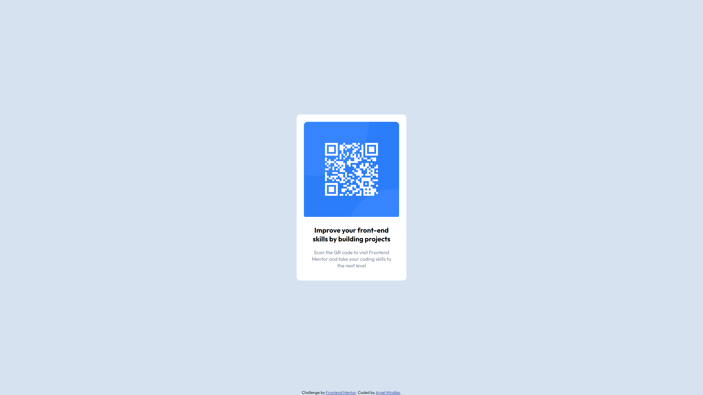
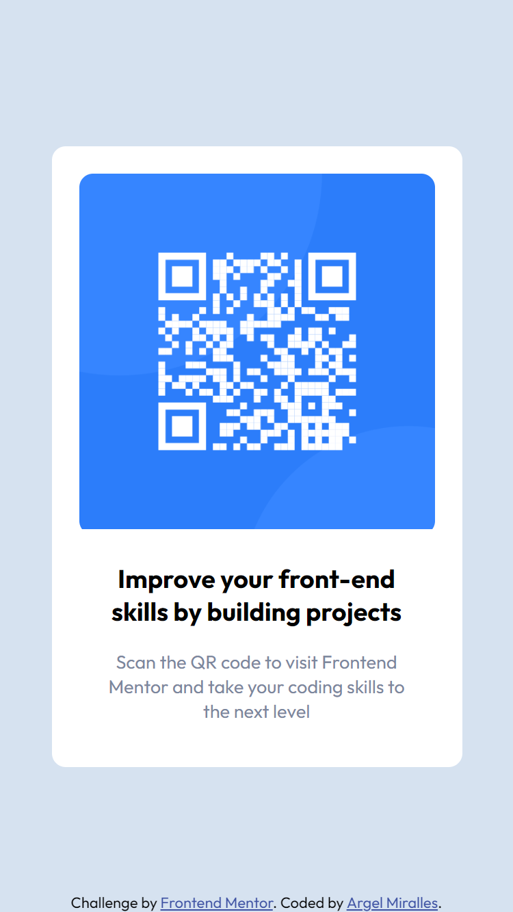

# Frontend Mentor - QR code component

Note: The photo above is the design preview for the challenge. The actual preview of my project can be seen below.

## Welcome! 👋

Thanks for checking out this front-end coding challenge.
This is a simple web application showcasing my command of HTML and CSS.

## The challenge

This challenge is straightforward. This one of the first challenges I took after relearning HTML and CSS so it was a nice refresher.

## My solution

I created this card with a maximum width since this component will mostly like be this small or even smaller when used in a project. I then implemented proper
sizing of padding and margins to acheive the target layout.

## Technologies used

- HTML - Used to create the index.html file
- CSS - Used to design the webpage
- VSCode - IDE I used to create the web app
- Git - For version control
- Netflify - Used to host this web app

## Preview

## Deployment

You may visit the deployed web app through the link below.

- [https://amiralles-qrcodecard.netlify.app/](https://amiralles-qrcodecard.netlify.app/)

## Footer

Thank you for taking the time in checking out this repository.

**Argel Miralles | Full Stack Web Developer** 
**SIC PARVIS MAGNA**☝
